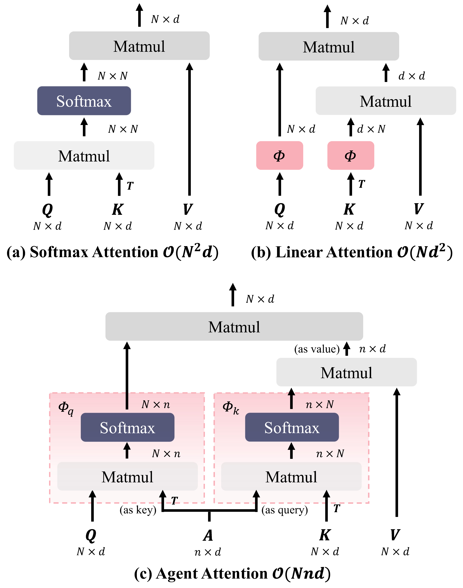
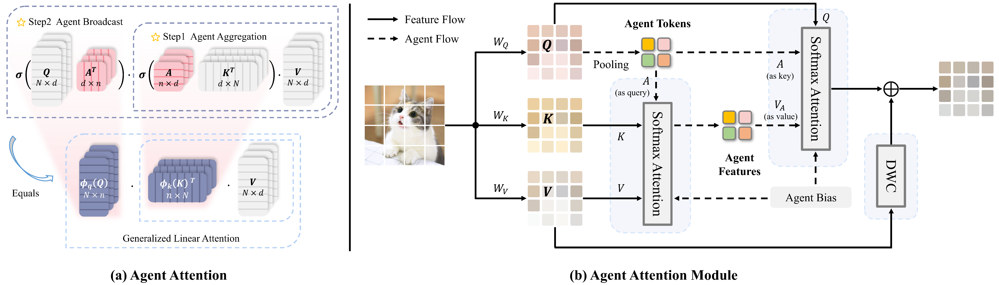
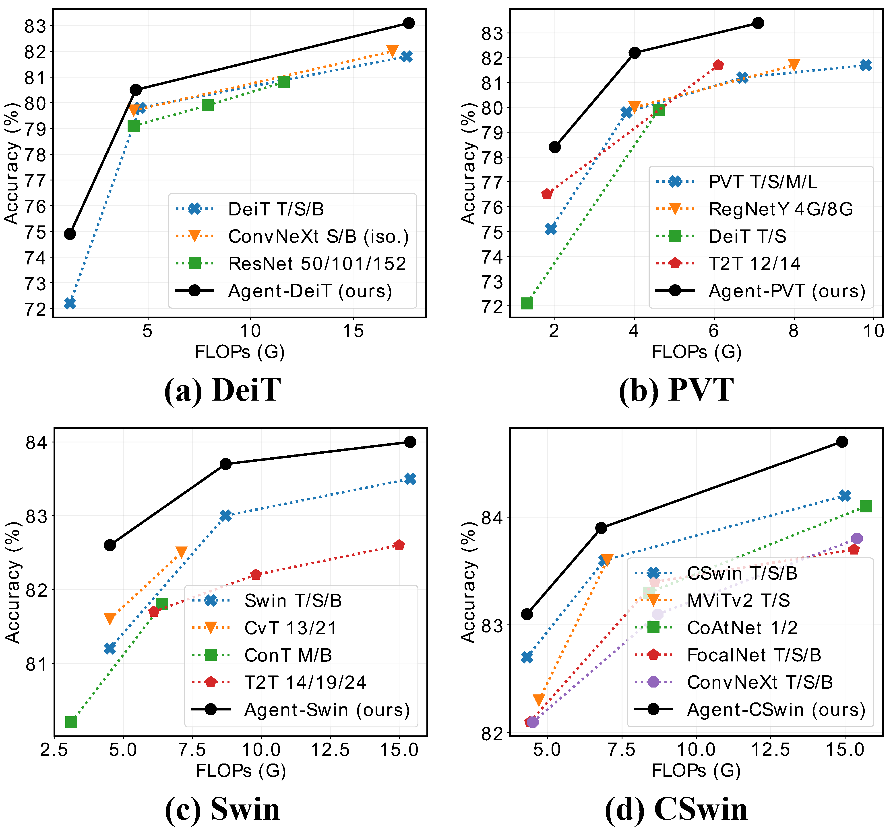
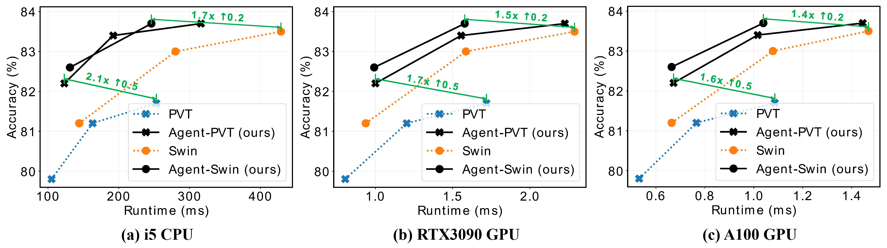
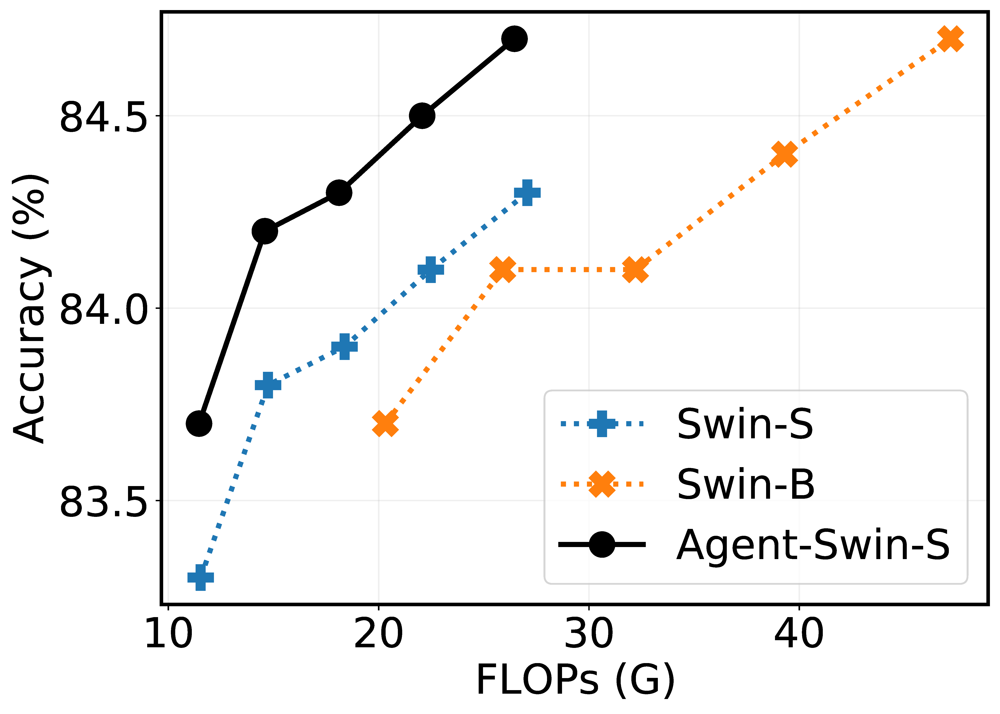
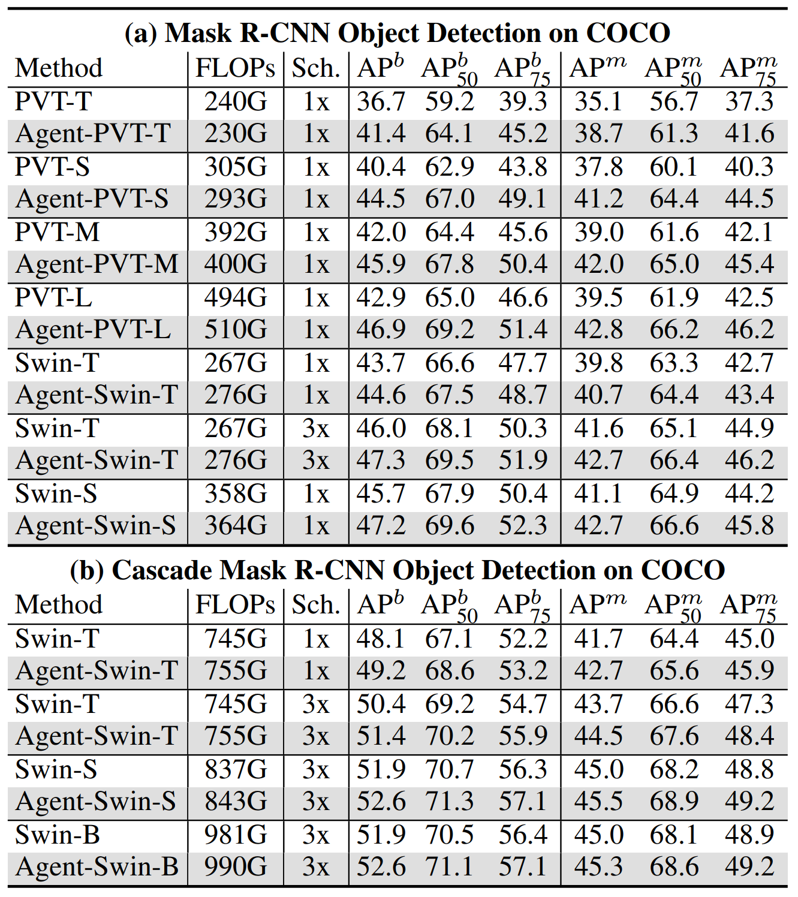
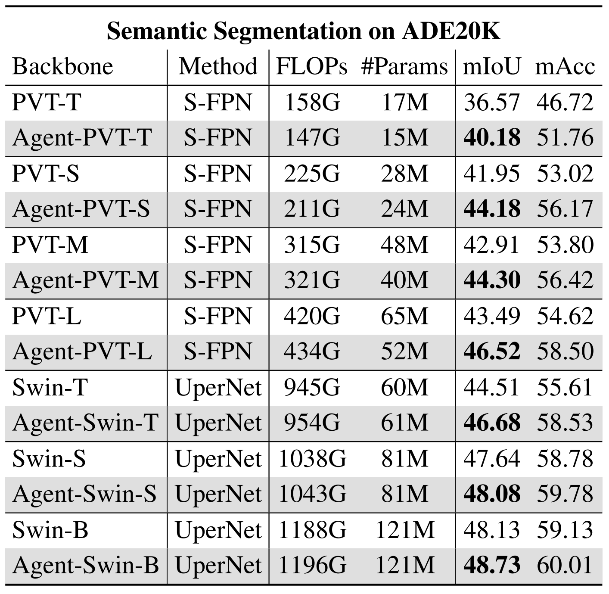
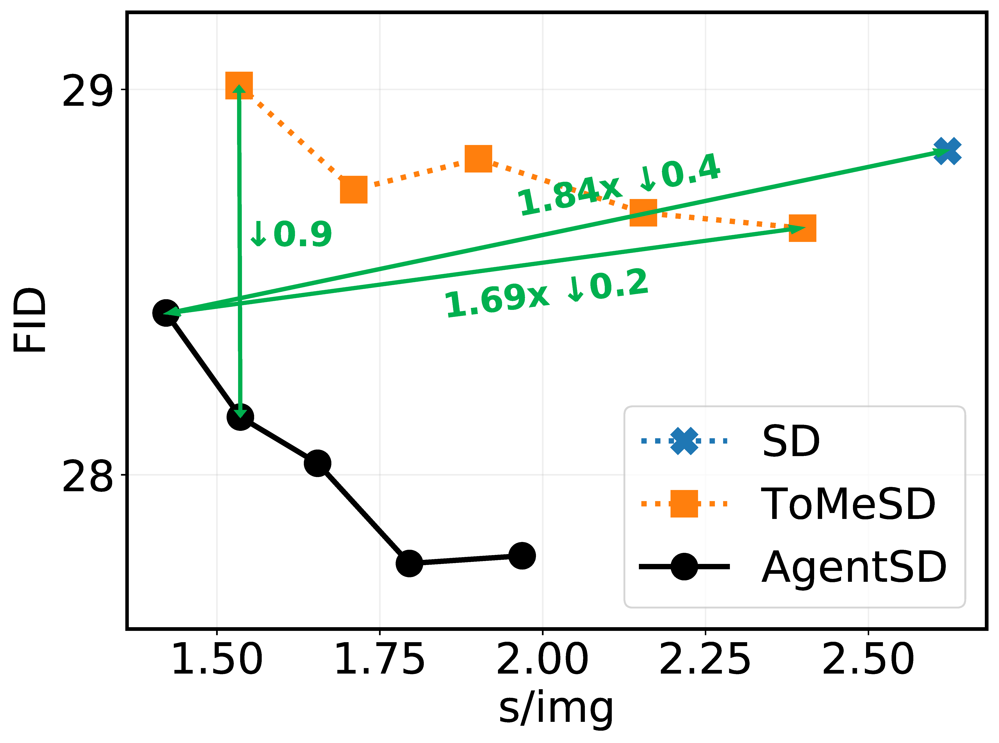
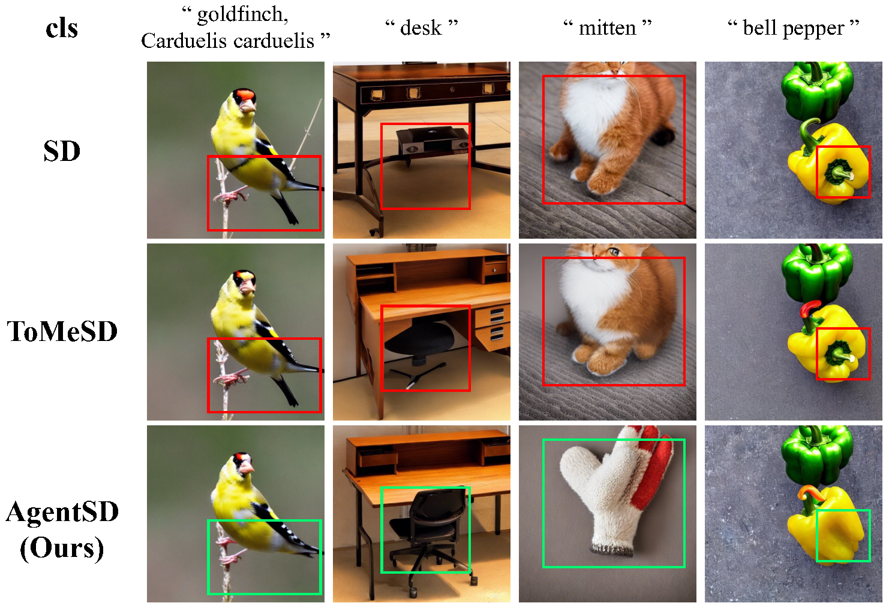

# Agent Attention

This repo contains the official PyTorch code and pre-trained models for **Agent Attention**.

+ [Agent Attention: On the Integration of Softmax and Linear Attention](https://arxiv.org/abs/2312.08874)

## Introduction

<p align="center">
    
</p>


The attention module is the key component in Transformers. While the global attention mechanism offers robust expressiveness, its excessive computational cost constrains its applicability in various scenarios. In this paper, we propose a novel attention paradigm, **Agent Attention**, to strike a favorable balance between computational efficiency and representation power. Specifically, the Agent Attention, denoted as a quadruple $(Q, A, K, V)$, introduces an additional set of agent tokens $A$ into the conventional attention module.  The agent tokens first act as the agent for the query tokens $Q$ to aggregate information from $K$ and $V$, and then broadcast the information back to $Q$. Given the number of agent tokens can be designed to be much smaller than the number of query tokens, the agent attention is significantly more efficient than the widely adopted Softmax attention, while preserving global context modelling capability. Interestingly, we show that the proposed agent attention is equivalent to a generalized form of linear attention. Therefore, agent attention seamlessly integrates the powerful Softmax attention and the highly efficient linear attention.


## Method

<p align="center">
    
</p>

**An illustration of our agent attention and agent attention module.** (a) Agent attention uses agent tokens to aggregate global information and distribute it to individual image tokens, resulting in a practical integration of Softmax and linear attention. $\rm{\sigma}(\cdot)$ represents Softmax function. In (b), we depict the information flow of agent attention module. As a showcase, we acquire agent tokens through pooling. Subsequently, agent tokens are utilized to aggregate information from $V$, and $Q$ queries features from the agent features. In addition, agent bias and DWC are adopted to add positional information and maintain feature diversity.

## Results

### Classification

Please go to the folder [agent_transformer](./agent_transformer) for specific document.

- Comparison of different models on ImageNet-1K.

<p align="center">
    
</p>

- Accuracy-Runtime curve on ImageNet.

<p align="center">
    
</p>

- Increasing resolution to $\{256^2, 288^2, 320^2, 352^2, 384^2\}$.

<p align="center">
    
</p>

### Downstream tasks

Please go to the folder [detection](./downstream/detection), [segmentation](./downstream/segmentation) for specific documents.

<div style="display: flex; justify-content: center;">
    
    
</div>

### AgentSD

When applied to Stable Diffusion, our agent attention accelerates generation and substantially enhances image generation quality **without any additional training**. Please go to the folder [agentsd](./agentsd) for specific document.

- Quantitative Results of Stable Diffusion, ToMeSD and our AgentSD.

<p align="center">
    
</p>

- Samples generated by Stable Diffusion, ToMeSD ($r=0.4$) and AgentSD ($r=0.4$).

<p align="center">
    
</p>

## TODO

 - [x] Classification
 - [x] Segmentation
 - [x] Detection
 - [x] Agent Attention for Stable Diffusion


## Acknowledgements

Our code is developed on the top of [PVT](https://github.com/whai362/PVT), [Swin Transformer](https://github.com/microsoft/Swin-Transformer), [CSwin Transformer](https://github.com/microsoft/CSWin-Transformer) and [ToMeSD](https://github.com/dbolya/tomesd).

## Citation

If you find this repo helpful, please consider citing us.

```latex
@article{han2023agent,
  title={Agent Attention: On the Integration of Softmax and Linear Attention},
  author={Han, Dongchen and Ye, Tianzhu and Han, Yizeng and Xia, Zhuofan and Song, Shiji and Huang, Gao},
  journal={arXiv preprint arXiv:2312.08874},
  year={2023}
}
```

## Contact

If you have any questions, please feel free to contact the authors. 

Dongchen Han: [hdc23@mails.tsinghua.edu.cn](mailto:hdc23@mails.tsinghua.edu.cn)

Tianzhu Ye:  [ytz20@mails.tsinghua.edu.cn](mailto:ytz20@mails.tsinghua.edu.cn)
